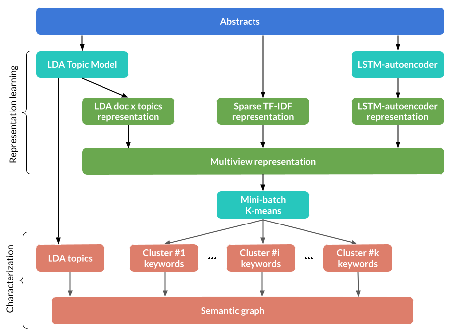

# Clustering and topic modeling for biomedical text mining

We propose an integrative approach to the problem of characterizing an unlabelled corpus of biomedical documents in an unsupervised manner. The integration is twofold. On one hand, we integrate, with multiview learning, different text representations derived from a traditional bag-of-words model, Latent Dirichlet Allocation, and a recurrent neural autoencoder. On the other hand, we integrate topic modeling outputs, clustering outputs and biomedical word embeddings to generate an intuitive and comprehensive characterization of the corpus. We also propose a semantic graph that supplies a synthetic visualization of the relationships between topics, clusters, and any other biomedical concept, based on semantic similarity. 

The notebooks in this repository constitute an application of our methodology to the CORD-19 dataset, a collection of articles on COVID-19, shows our methodology produces a coherent, meaningful, and informative characterization of the corpus. They are organized as follows:

- 1_EDA_data_cleaning_preprocessing: data loading, exploratory data analysis, data cleaning and pre-processing.
- 2_LDA_TF_IDF_individual_rep_learning: learning of the TF-IDF and LDA representations as well as LDA topics. Some fine tuning is performed.
- 2b_LSTM_autoencoder_rep_learning: learning of the LSTM-autoencoder representation.
- 3_comparison_representations: comparison of individual representations.
- 4_multiview_rep_learning_clustering: learning of the multiview MDS representation and extraction of keywords by clusters.
- 5_similarity_functions: examples of how, for a given abstract, we are able to retrieve the closest topics, closest clusters and closests neighbours in our MVMDS representation.
- 6_semantic_graph: construction of the semantic graph and example of our external concepts can be mapped into the graph. 

Here is an overview of our methodology:

